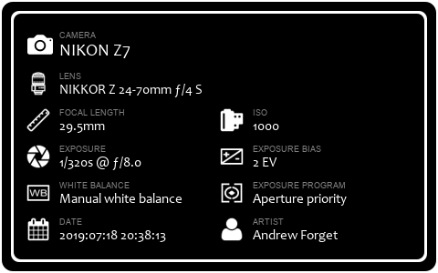

# ImageDetailsCore

The ImageDetailsCore project is a .NET Core console application which uses MetadataExtractor and System.Drawing to load the EXIF data from an image file and produces an image details badge PNG (in the same location using the -info.png suffix). This can be used to show the details about photographs on social media platforms as a nice way to display the camera settings.

## Sample



The information shown includes the camera, lens, focal length, ISO, shutter speed and aperture F-stop, EV bias, white balance program, exposure program, date/time and artist.

| Property        | Source EXIF                                     |
| --------------- | ----------------------------------------------- |
| Camera          | IFD0/Model or SubIFD/Model                      |
| Lens            | SubIFD/Lens Model                               |
| Focal Length    | SubIFD/Focal Length or SubIFD/Focal Length 35   |
| ISO             | SubIFD/ISO Speed Ratings                        |
| Shutter         | SubIFD/Exposure Time                            |
| Aperture        | SubIFD/F-Number                                 |
| EV Bias         | SubIFD/Exposure Bias Value                      |
| White Balance   | SubIFD/White Balance Mode + SubIFD/White Balance|
| Exposure Prgm   | SubIFD/Exposure Program                         |
| Date            | SubIFD/Date/Time Original                       |
| Artist          | IFD0/Artist or SubIFD/Artist                    |

Additionally, the Camera and Lens properties are then mapped from a source string to a finalized string using the Resources/CameraMap.json and Resources/LensMap.json. The files currently have the data I use for various cameras and lenses to produce cleaner text. Without changing the source code, mappings can be added to the file to do the same.  Currently the code will emit a warning whenever a camera or lens string is not found, it would be easy to remove those two warnings.

If the camera (Model) is not found in the tags, the badge will not be created and a message will be emitted.

## Using the application

Once built (VS 2019 or VS 2019 for Mac to build), simply run the following command:

```
ImageDetailsCore [full path to the image file][...additional full paths]
```

On Windows, you can drop files right on the ImageDetailsCore.exe file. On the Mac, I created an Automator script with a Run Shell Script that runs the ImageDetailsCore application with 'accepts files' and then shows a message with the output. The downside to this is that the ImageDetailsCore output needs to be in a fixed location and a fully qualified path is required in the run shell script task.

The application is currently using System.Drawing which means that the libgdiplus library is required for Linux and MacOS.

For the MacOS, I used homebrew to install the library:

```
brew install mono-libgdiplus
```

Likely for your Linux distro, a similar 'apt', 'yum' or other package installer should be able to install the libgdiplus component.

If you have the .NET Core SDK installed on your machine, you can also build just by changing directory to the location of the .SLN file and running dotnet:

```
dotnet build -c Release
```

This will build the release configuration of the application.
