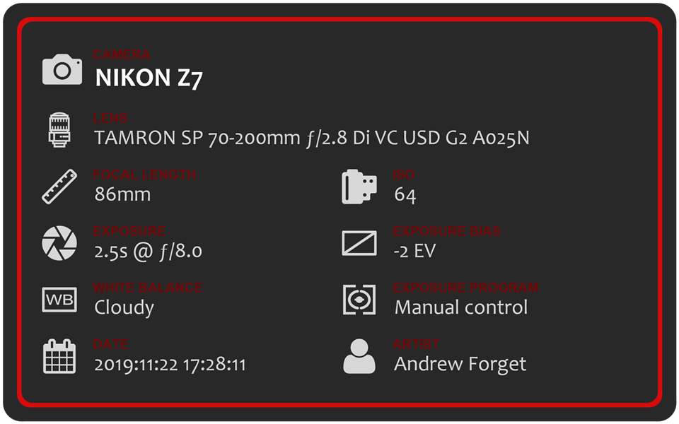

# ImageDetailsCore

The ImageDetailsCore project is a .NET Core console application which uses MetadataExtractor and System.Drawing to load the EXIF data from an image file and produces an image details badge PNG (in the same location using the _info.png suffix). This can be used to show the details about photographs on social media platforms as a nice way to display the camera settings.

## Status


## Sample


The information shown includes the camera, lens, focal length, ISO, shutter speed and aperture F-stop, EV bias, white balance program, exposure program, date/time and artist.

| Property        | Source EXIF                                     |
| --------------- | ----------------------------------------------- |
| Camera          | IFD0/Model or SubIFD/Model                      |
| Lens            | SubIFD/Lens Model                               |
| Focal Length    | SubIFD/Focal Length or SubIFD/Focal Length 35   |
| ISO             | SubIFD/ISO Speed Ratings                        |
| Shutter         | SubIFD/Exposure Time                            |
| Aperture        | SubIFD/F-Number                                 |
| EV Bias         | SubIFD/Exposure Bias Value                      |
| White Balance   | SubIFD/White Balance Mode + SubIFD/White Balance|
| Exposure Prgm   | SubIFD/Exposure Program                         |
| Date            | SubIFD/Date/Time Original                       |
| Artist          | IFD0/Artist or SubIFD/Artist                    |

Additionally, the Camera and Lens properties are then mapped from a source string to a finalized string using the Resources/Options.json file. This file currently has the data I use for various cameras and lenses to produce cleaner text. Without changing the source code or recompiling, mappings can be added, removed or modified in the file to do the same for your equipment. The code can emit a warning whenever a camera or lens string is not found. To skip the warning output, change the `warnMissingCamera` and `warnMissingLens` options to `false`. To enable the warning, change the values to `true`.

If the camera (Model EXIF tag) is not found in the tags, the badge will not be created and an error message will be emitted.

## Options file

The Resources/Options.json file contains a few options for the tool.

> `theme`

String value for the badge theme to change the colors of the badge.

Current themes are (any other value will revert to the `black` theme):

### `black`


### `white`


### `dark`


### `light`


### `nikon`


### `canon`



### `olympus`


> `useScaling`

Boolean flags to use scaled images for better quality output (rendering will be done at 4x and final output will be 2x normal when this is set to `true`).

> `warnMissingCamera` and `warnMissingLens`

Boolean flags to turn on and off warning about missing camera and lens mapping in the `cameras` and `lenses` options.

> `recursiveFolders`

Boolean flag set to `true` to recursively handle folders when the application is passed a folder as an argument or set to `false` to only process files in the root folder when passed a folder as an argument.

> `folderSearchExtensions` 

An array of strings of extensions for files to be processed when a folder is passed as an argument. Only files matching the extensions will be processed.

> `cameras` and `lenses`

Two arrays of mapping objects with a `source` string and a `display` string. Whenever a camera is found in the EXIF data that matches the `source` property of an entries in the `cameras` array, the camera is changed to the `display` property. Same for `lenses`. This is used to produce a more pleasing (and consistent) output.  eg:

``` json
  "cameras": [
    { "source": "NIKON Z 7", "display": "NIKON Z7" },
  ],
  "lenses": [
    { "source": "24-70 mm F_4.0", "display": "NIKKOR Z 24-70mm f/4 S" },
  ]
```

If the camera is `NIKON Z 7`, the badge will show `NIKON Z7` instead. If the lens is `24-70 mm F_4.0`, the badge will show `NIKKOR Z 24-70mm f/4 S`.

## User option files

To separate the option files and provide a stable base file, the code will now look in the user's home folder for a file named `.imagedetailscore_options.json` before it looks for the `Options.json` file in the application's folder first. If that file is found, it will use that file, otherwise the default `Options.json` file will be used. This allows users to keep their own options file separate from the source code and build to allow easier customization. To add a custom options file to the repository, copy the `Options.json` file to a file under the `Custom Options` folder using the pattern *{username}*`.imagedetailscore_options.json`

## Using the application

Once built (VS 2019 or VS 2019 for Mac to build), simply run the following command:

```
ImageDetailsCore [full path to the image file][full path to folder of images][...additional full paths]
```

On Windows, you can drop files or folders right on the ImageDetailsCore.exe file. On the Mac, I created an Automator script with a Run Shell Script that runs the ImageDetailsCore application with 'accepts files' and then shows a message with the output. The downside to this is that the ImageDetailsCore output needs to be in a fixed location and a fully qualified path is required in the run shell script task.

## Dependencies

The tool requires two fonts to be installed.  `Arial` and `Candara`. If you would prefer different fonts, you will need to grab the code and alter the font names in the `DrawValue` method. The `Arial` font is used for the value labels and the `Candara` font is used for the value itself. Both were installed and available on MacOS and Windows, but they may have come with Office or the OS itself, not sure.

## Building

If you have the .NET Core SDK installed on your machine, you can also build just by changing directory to the location of the .SLN file and running dotnet:

```
dotnet build -c Release
```

This will build the release configuration of the application.

Alternatively, you can load the .SLN file using VS 2019 or VS 2019 for Mac and build the solution.
